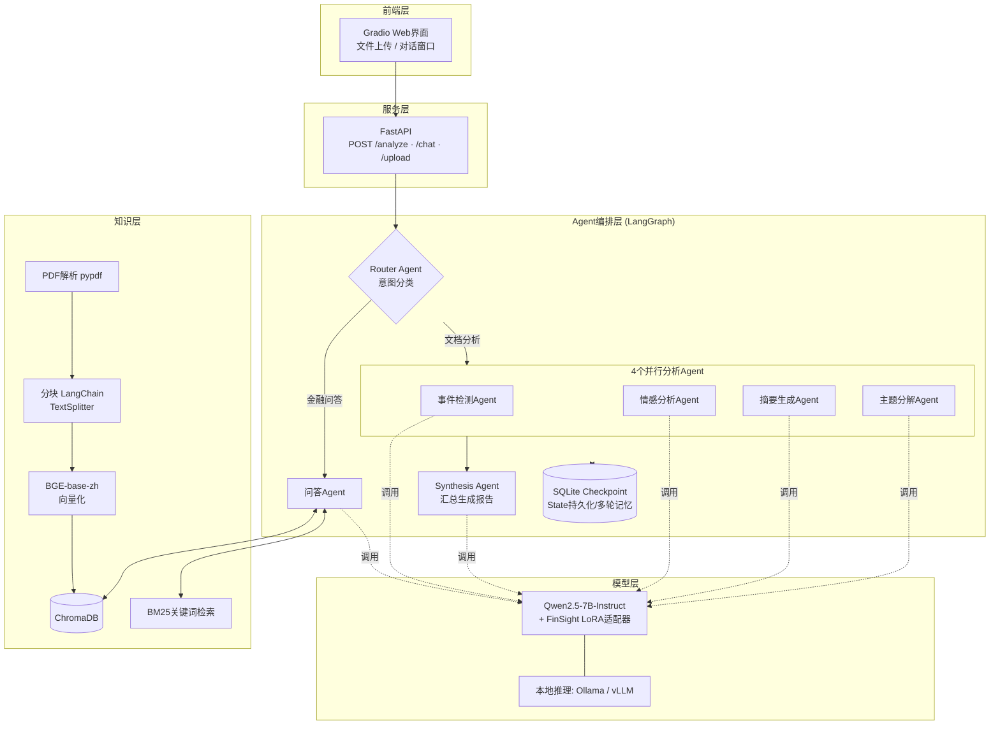
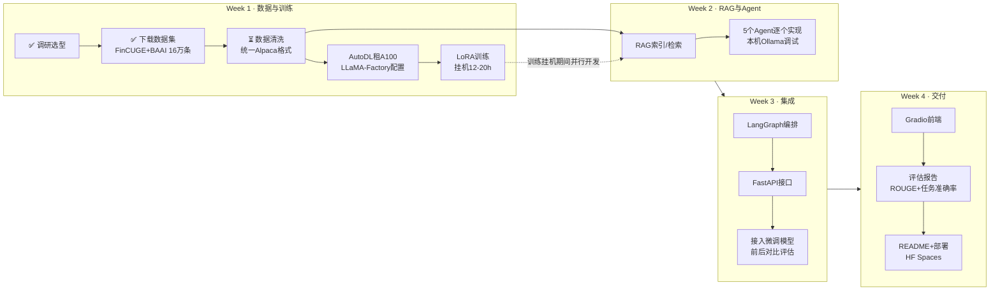

# FinSight 工程推进总览

> 本文档回答三个问题：系统长什么样（框图）、怎么一步步做出来（流程图）、每一步用什么工具以及为什么（选型表）。
> 配套文档：[FinSight-PLAN.md](FinSight-PLAN.md)（按周任务清单与进度日志）

---

## 一、系统框图（最终交付形态）

---

## 二、推进流程图（开发过程，含当前位置）

**关键并行策略**：A5训练在云端挂机12-20小时，这期间本机用Ollama基座模型开发Week 2全部内容——Agent代码只依赖"有一个能对话的LLM"，先用基座模型把链路跑通，训练完成后把模型一换（改一行配置），直接进入对比评估。

---

## 三、每阶段工具选型与理由

### 阶段1：数据处理

| 用途 | 选用 | 候选对比 | 选择理由 |
|------|------|---------|---------|
| 数据下载 | HuggingFace `datasets` | 手动wget / git clone | 自动缓存、断点续传、版本固定；`load_dataset`一行代码 |
| 数据清洗 | pandas + 正则 | Spark / dask | 16万条是小数据，单机pandas秒级处理，引入分布式纯属浪费 |
| 格式标准 | Alpaca三字段 (instruction/input/output) | ShareGPT多轮格式 | 我们的任务全是单轮指令型；LLaMA-Factory两种都支持，Alpaca更简单 |

### 阶段2：模型微调

| 用途 | 选用 | 候选对比 | 选择理由 |
|------|------|---------|---------|
| 基座模型 | Qwen2.5-7B-Instruct | ChatGLM3-6B / Baichuan2 / LLaMA3 | 中文能力同级最强；金融语料预训练充分；7B在A100上LoRA从容；LLaMA3中文弱 |
| 微调方法 | LoRA (r=16) | 全量微调 / QLoRA / P-Tuning | 全量需8×A100不现实；QLoRA省显存但我们A100显存够，不必牺牲精度；LoRA是业界默认 |
| 训练框架 | LLaMA-Factory | transformers Trainer / axolotl / swift | yaml配置零代码启动；原生支持Qwen+Alpaca格式；文档全、社区大，排错快 |
| 训练硬件 | AutoDL A100 40GB | Colab Pro / 本机M2 Ultra | Colab会话有时限不适合20h挂机；Mac的MLX生态训练7B不成熟；AutoDL按小时计费约100元 |
| 实验跟踪 | LLaMA-Factory自带loss曲线 + SwanLab(可选) | wandb / tensorboard | wandb国内访问不稳；SwanLab是国产平替，面试演示加分 |

### 阶段3：RAG知识库

| 用途 | 选用 | 候选对比 | 选择理由 |
|------|------|---------|---------|
| PDF解析 | pypdf | PyMuPDF / unstructured | 研报PDF以文字为主，pypdf够用且零依赖；扫描件多再换unstructured+OCR |
| 文本分块 | LangChain RecursiveCharacterTextSplitter | 固定长度切分 | 递归分块按段落→句子层级切，保住语义完整性；中文设置separators=["\n\n","\n","。"] |
| Embedding | BGE-base-zh-v1.5 | OpenAI ada / m3e / bce | 中文检索榜(C-MTEB)开源第一梯队；本地跑不花钱不泄露数据；ada要API且中文一般 |
| 向量库 | ChromaDB | FAISS / Milvus / Pinecone | 自带持久化+元数据过滤，FAISS裸库还要自己包一层；Milvus要起服务，Demo过重；面试答"生产换Milvus" |
| 关键词检索 | rank_bm25 | ElasticSearch | 纯Python库10行代码实现；ES是生产方案，Demo杀鸡用牛刀 |
| 混合策略 | RRF倒数排名融合 | 加权分数融合 | RRF不需要调权重超参，对分数尺度不敏感，论文背书足 |

### 阶段4：Agent系统

| 用途 | 选用 | 候选对比 | 选择理由 |
|------|------|---------|---------|
| 编排框架 | LangGraph | LangChain Agent / AutoGen / CrewAI | 有条件分支+并行扇出汇聚，必须图结构；AutoGen偏自由对话不可控；CrewAI抽象太高黑盒多；JD明确点名LangGraph |
| 状态管理 | LangGraph State + reducer | 自管全局dict | 并行节点写冲突框架已解决；checkpoint白送多轮记忆和容错 |
| 记忆持久化 | SqliteSaver checkpoint | Redis / ConversationBufferMemory | 单机Demo用SQLite零部署；State即Memory，不需要再挂一个Memory组件 |
| 开发期LLM | 本机Ollama (qwen2.5:7b) | 云API (按token付费) | M2 Ultra推理0.4-0.8s/次；不花钱、无网络依赖、和最终模型同源 |
| 部署期推理 | Ollama自定义模型(LoRA合并后GGUF) | vLLM | Mac上Ollama最顺；如果部署到Linux服务器换vLLM(吞吐高10倍) |

### 阶段5：服务与前端

| 用途 | 选用 | 候选对比 | 选择理由 |
|------|------|---------|---------|
| 流式输出 | SSE (StreamingResponse) | WebSocket | 单向推送场景SSE更简单，浏览器原生支持；WebSocket用于双向场景，此处不需要 |
| 前端 | Gradio | Streamlit / 手写Vue | 内置Chatbot+文件上传组件；一行代码挂HF Spaces公网演示；Streamlit偏数据看板 |
| 演示部署 | HuggingFace Spaces | 阿里云ECS / Vercel | 免费、自带GPU可选、面试官点链接即用；ECS要钱要运维 |

### 阶段6：评估

| 用途 | 选用 | 候选对比 | 选择理由 |
|------|------|---------|---------|
| 摘要质量 | ROUGE-L / ROUGE-1 | BLEU | 摘要任务标准指标；BLEU偏机器翻译 |
| 分类任务 | 准确率/F1 (情感、新闻分类) | — | FinCUGE自带15k评估集，按任务标签分Agent出分 |
| 生成质量 | LLM-as-Judge (基座模型当裁判) | 人工标注 | 单人项目没有标注预算；用强模型按维度打分是业界通行做法 |
| 对比基线 | 微调前 vs 微调后同题对比 | — | `/tmp/lg_demo/test_qwen_finance.py` 已留好基线测试脚本 |

---

## 四、工具选型的三条总原则

1. **Demo优先跑通，生产方案口头讲**：每处选型都准备"生产环境我会换成X"的答案（ChromaDB→Milvus、BM25→ES、Ollama→vLLM、SQLite→Redis）。面试官要的是你知道边界在哪，不是Demo里真用Milvus。
2. **JD点名的直接用**：LangChain/LangGraph/FastAPI是给面试官看的关键词，不做替代选择。
3. **本机能跑的不上云**：开发期全部用本机Ollama+本地向量库，唯一花钱的是AutoDL训练（约100元）。

---

## 五、风险与备选路径

| 风险 | 概率 | 备选方案 |
|------|------|---------|
| AutoDL A100缺货 | 中 | 换4090(24G)+QLoRA，或V100×2 |
| 16万条训练后效果提升不明显 | 低 | 聚焦FinCUGE做任务级评估(分类/摘要有硬指标必有提升)；叙事改为"格式稳定性+任务专精" |
| LoRA合并GGUF量化损失大 | 低 | Ollama直接挂载safetensors LoRA，或Mac上用mlx-lm推理 |
| HF Spaces免费档跑不动7B | 高 | 演示视频+本机录屏兜底；Spaces放Gradio界面调本机内网穿透 |
